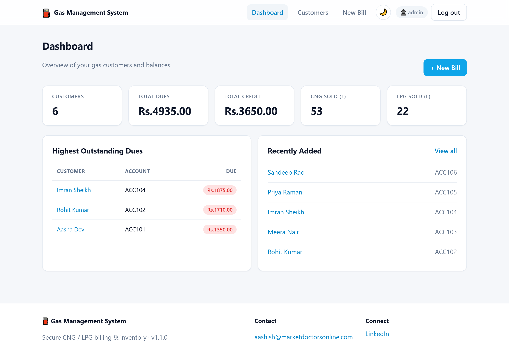
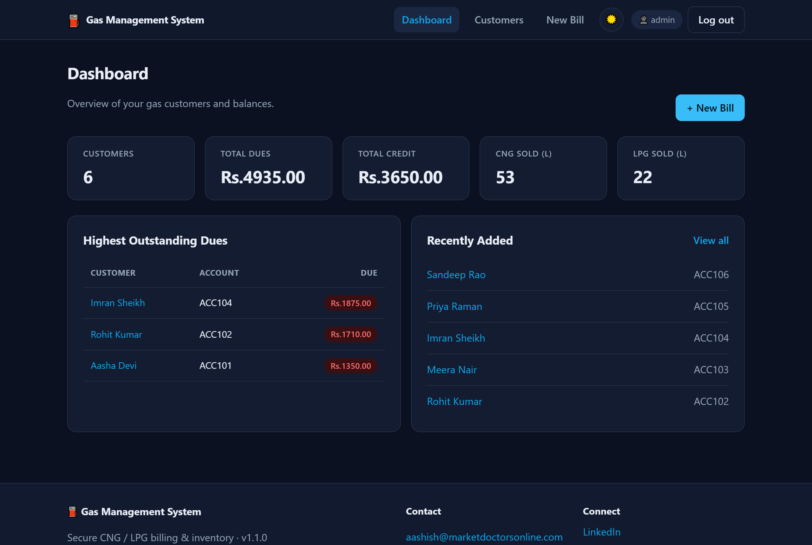
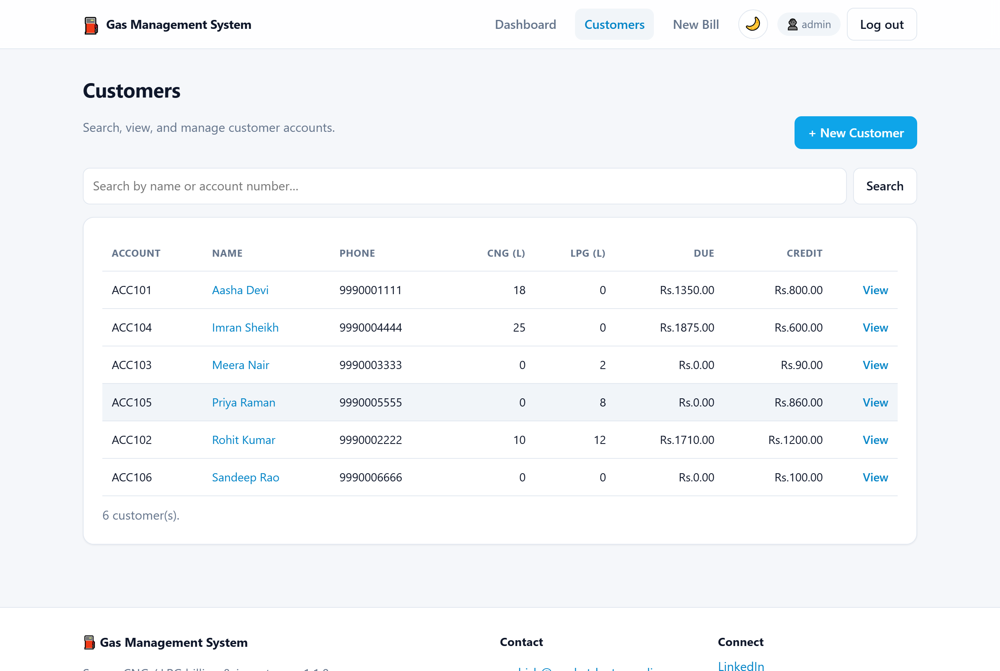
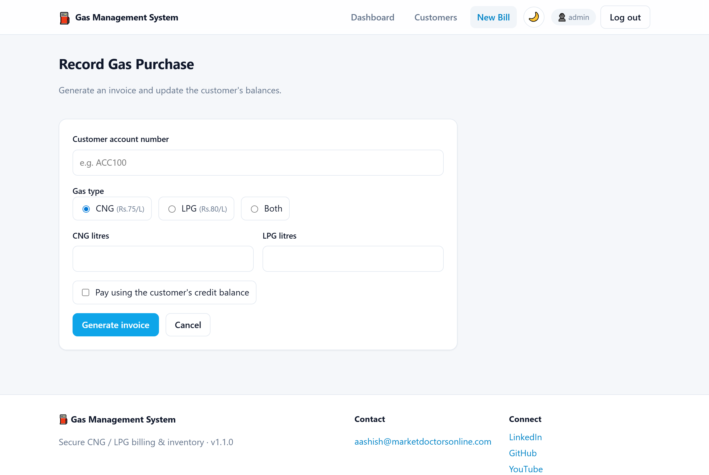
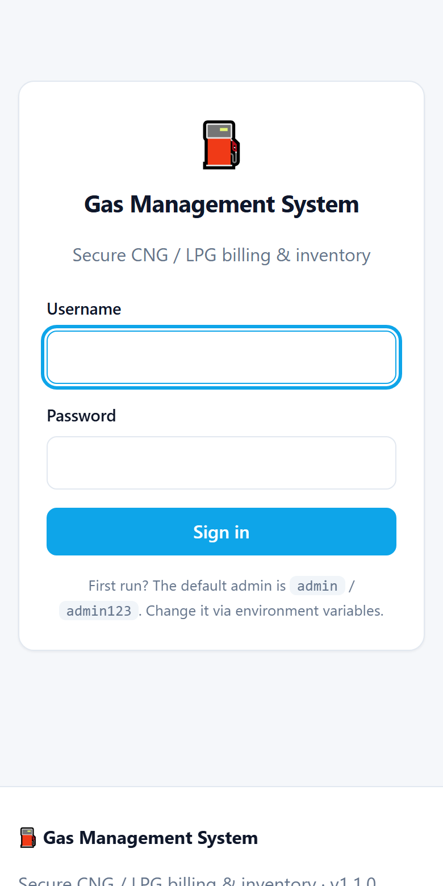

<div align="center">

# ⛽ Gas Management System

**A secure, modern terminal application for managing gas (CNG / LPG) customers, billing, and inventory.**

[](https://github.com/aashishbharti04/gas-management-system/actions/workflows/ci.yml)
[](LICENSE)
[](https://www.python.org/)
[](https://github.com/astral-sh/ruff)
[](CONTRIBUTING.md)

</div>

---

## 📖 Project Overview

**Gas Management System** helps small gas distributors manage customer accounts,
generate CNG/LPG invoices, and track outstanding balances and credit. It began life
as a student project and has been re-engineered into a clean, secure, well-tested,
production-ready open-source tool.

It ships with **two front-ends that share the same code and data**:

- 🖥️ a premium **terminal CLI** (`rich`-powered), and
- 🌐 an optional **web dashboard** (FastAPI + server-rendered, dark/light, responsive).

It runs out of the box with a built-in **SQLite** database (zero configuration) and
optionally supports **MySQL** for multi-user or networked deployments.

> **Why this rewrite?** The original prototype had hard-coded database passwords,
> SQL-injection-prone queries, plaintext credentials, and numerous bugs that
> prevented billing from working at all. This version preserves every feature while
> fixing the security and correctness issues — see the [CHANGELOG](CHANGELOG.md).

---

## ✨ Features

- 🖥️🌐 **CLI *and* web dashboard** — same services, same database, your choice of interface.
- 🔐 **Secure login** with salted **PBKDF2-HMAC-SHA256** password hashing (no plaintext).
- 👤 **Customer accounts** — create, view, search, list, and delete.
- 🧾 **Automated billing** for CNG, LPG, or both, with configurable per-litre pricing.
- 💳 **Credit & dues tracking** — pay from a stored credit balance or accrue an amount due.
- 🗄️ **Pluggable storage** — SQLite by default; MySQL optional via the same interface.
- 🛡️ **Security first** — parameterised queries everywhere, env-based secrets, input validation.
- 🎨 **Premium terminal UI** powered by [`rich`](https://github.com/Textualize/rich):
  banners, tables, loading spinners, and clear success/error/empty states.
- 🌗 **Theme-aware & accessible** — respects `NO_COLOR`, degrades gracefully to plain text.
- ✅ **Fully tested** — 35+ unit/integration tests, linted with Ruff, CI on every push.

---

## 📸 Screenshots

### 🌐 Web Dashboard

| Light mode | Dark mode |
| :--------: | :-------: |
|  |  |

**Customers** — searchable list with live filtering



**New bill** — record a CNG/LPG purchase



<table>
  <tr>
    <td align="center"><b>Responsive (mobile)</b></td>
  </tr>
  <tr>
    <td align="center"></td>
  </tr>
</table>

### 🖥️ Terminal CLI

```
┌───────────────────────────── Menu ──────────────────────────────┐
│   1   Create customer account                                    │
│   2   Record gas purchase / generate bill                        │
│   3   View a customer's details                                  │
│   4   List all customers                                         │
│   5   Search customers                                           │
│   6   Delete a customer                                          │
│   0   Log out & exit                                             │
└──────────────────────────────────────────────────────────────────┘
```

---

## 🚀 Installation Guide

### Prerequisites

- **Python 3.9+**
- (Optional) A **MySQL** server if you choose the MySQL backend.

### Install from source

```bash
# 1. Clone
git clone https://github.com/aashishbharti04/gas-management-system.git
cd gas-management-system

# 2. (Recommended) create a virtual environment
python -m venv .venv
# Windows:  .venv\Scripts\activate
# macOS/Linux:  source .venv/bin/activate

# 3. Install
pip install .
#   or, for development (editable + dev tools):
pip install -e ".[dev]"

#   with MySQL support:
pip install ".[mysql]"

#   with the web dashboard:
pip install ".[web]"
```

---

## 📋 Usage Guide

Run the app:

```bash
gas-management          # via the installed console script
# or
python -m gas_management
```

On first run, a default administrator (`admin` / `admin123`) is **seeded** and you are
prompted to change it via environment variables. After logging in you’ll see the menu:

| Option | Action |
| ------ | ------ |
| `1` | Create a customer account |
| `2` | Record a gas purchase and generate a bill |
| `3` | View a single customer's details |
| `4` | List all customers |
| `5` | Search customers by name or account number |
| `6` | Delete a customer |
| `0` | Log out & exit |

**Example: record a sale**

1. Choose `2`, enter the customer's account number.
2. Pick gas type (`1` CNG, `2` LPG, `3` Both) and enter litres.
3. Choose whether to pay from the customer's credit balance.
4. The invoice is printed and balances are updated automatically.

---

## 🌐 Web Dashboard

A modern, optional web dashboard ships alongside the CLI and shares the **same
database and login accounts**.

```bash
pip install ".[web]"

# Generate a session secret (recommended for anything beyond local testing)
export GMS_WEB_SECRET_KEY="$(python -c 'import secrets;print(secrets.token_urlsafe(48))')"

gas-management-web            # or: python -m gas_management.web
# → open http://127.0.0.1:8000
```

Dashboard features:

- **Login** using the same hashed credentials as the CLI (secure signed sessions).
- **At-a-glance stats** — customer count, total dues, total credit, litres sold.
- **Customers** — searchable list (with skeleton-loading live search), create, view, delete.
- **Billing** — record CNG/LPG purchases and view a generated invoice.
- 🌗 **Dark & light mode** (remembers your choice; respects system preference).
- 📱 **Responsive** layout for mobile, tablet, and desktop.
- ♿ **Accessible** — semantic HTML, skip link, focus states, `aria` attributes,
  reduced-motion support, and colour pairs that don't rely on colour alone.
- 🛡️ **Hardened** — CSRF protection on every form, strict security headers
  (CSP, X-Frame-Options, etc.), HttpOnly/SameSite session cookies.

> Configure host/port/secret/cookie-security via `GMS_WEB_*` variables — see
> [Configuration](#️-configuration-guide) and [`.env.example`](.env.example).

---

## ⚙️ Configuration Guide

All configuration is via environment variables (optionally loaded from a local `.env`
file — copy [`.env.example`](.env.example) to `.env`). **No secret is ever hard-coded.**

| Variable | Default | Description |
| -------- | ------- | ----------- |
| `GMS_DB_BACKEND` | `sqlite` | Storage backend: `sqlite` or `mysql`. |
| `GMS_SQLITE_PATH` | `gas_management.db` | SQLite database file path. |
| `GMS_MYSQL_HOST` | `localhost` | MySQL host. |
| `GMS_MYSQL_PORT` | `3306` | MySQL port. |
| `GMS_MYSQL_USER` | `root` | MySQL user. |
| `GMS_MYSQL_PASSWORD` | _(empty)_ | MySQL password. |
| `GMS_MYSQL_DATABASE` | `gasin` | MySQL database name. |
| `GMS_CNG_PRICE` | `75` | Price per litre of CNG. |
| `GMS_LPG_PRICE` | `80` | Price per litre of LPG. |
| `GMS_CURRENCY_SYMBOL` | `Rs.` | Currency symbol for display. |
| `GMS_ADMIN_USERNAME` | `admin` | Seeded admin username (first run only). |
| `GMS_ADMIN_PASSWORD` | `admin123` | Seeded admin password (first run only). |
| `GMS_WEB_HOST` | `127.0.0.1` | Web dashboard bind host. |
| `GMS_WEB_PORT` | `8000` | Web dashboard port. |
| `GMS_WEB_SECRET_KEY` | _(auto)_ | Secret for signing session cookies (set in production). |
| `GMS_WEB_COOKIE_SECURE` | `false` | Mark session cookies `Secure` (enable behind HTTPS). |

---

## 🌐 Deployment Guide

This is a single-user CLI, so "deployment" usually means installing it on a machine.

- **Local / single workstation:** use the default SQLite backend — nothing else needed.
- **Shared / networked:** set `GMS_DB_BACKEND=mysql` and point the `GMS_MYSQL_*`
  variables at your server so multiple operators share one dataset.
- **Containerised:** a minimal `Dockerfile` recipe and systemd notes are in
  [`docs/DEPLOYMENT.md`](docs/DEPLOYMENT.md).

See [docs/DEPLOYMENT.md](docs/DEPLOYMENT.md) for full instructions.

---

## 🤝 Contributing Guide

Contributions are very welcome! Please read [CONTRIBUTING.md](CONTRIBUTING.md) and our
[Code of Conduct](CODE_OF_CONDUCT.md) first. In short:

```bash
pip install -e ".[dev]"
ruff check .          # lint
ruff format .         # format
pytest                # run tests
```

Open an issue or pull request using the provided templates.

---

## ❓ FAQ

**Do I need MySQL?**
No. SQLite is the default and requires zero setup. MySQL is optional.

**Where is my data stored?**
In a local `gas_management.db` SQLite file by default (configurable via `GMS_SQLITE_PATH`).

**I forgot the admin password — what do I do?**
Delete the SQLite database file (or the `users` row) and re-run; a new admin will be
seeded from `GMS_ADMIN_USERNAME` / `GMS_ADMIN_PASSWORD`.

**Are card numbers stored?**
No. Unlike the original prototype, payment-card data is intentionally **not** collected
or stored. Only a contact phone number is kept.

**Is it safe from SQL injection?**
Yes. Every query uses parameterised statements; user input is never string-interpolated
into SQL.

**Can I change the prices/currency?**
Yes — set `GMS_CNG_PRICE`, `GMS_LPG_PRICE`, and `GMS_CURRENCY_SYMBOL`.

---

## 📄 License Information

This project is licensed under the **MIT License** — see [LICENSE](LICENSE) for details.

---

<div align="center">

## 📬 Contact & Connect

**Email:** [aashish@marketdoctorsonline.com](mailto:aashish@marketdoctorsonline.com)

[](https://in.linkedin.com/in/aashana1012)
[](https://github.com/aashishbharti04)
[](https://www.youtube.com/@CodeWithAsur)
[](https://www.instagram.com/asurwave1012)

---

© **Gas Management System**. All rights reserved.

_This project is open source and available for educational, learning, and community contributions._

</div>
